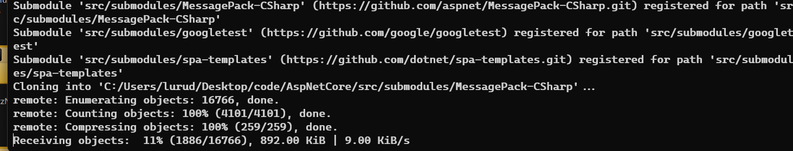
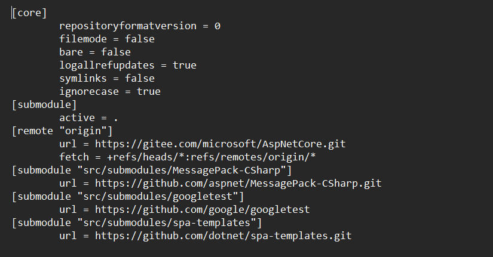

# ASP.NET CORE 7.0 源码编译

`勇气可嘉`

`最后还是失败`


## 基础环境：

前言：

源码GitHub地址

`[dotnet/aspnetcore at v7.0.0 (github.com)](https://github.com/dotnet/aspnetcore/tree/v7.0.0)`

## 准备工作：

1. 首先安装git
   https://gitforwindows.org/
2. 以及各种.net sdk 

## 下载.net core源码

```
1.下载安装Git
2.从git克隆
#执行如下指令下载源代码
git clone --recursive https://github.com/dotnet/aspnetcore.git
#注意这里需要加 --recursive，这样可以把依赖项一同下载
#如果执行过程因为网络原因报错，则多次执行下面指令
#用gitee国内加速
git clone --recursive https://gitee.com/microsoft/AspNetCore.git
git clone --recursive https://gitee.com/dong21/dhgaspnetcore.git

```


   此下源码下载完

  子项还是用github下载，我们可以修改成gitee



  修改如下：

 进入`.git`文件夹下config下

看到源配置文件如下：



修改成：

```sh
[core]
	repositoryformatversion = 0
	filemode = false
	bare = false
	logallrefupdates = true
	symlinks = false
	ignorecase = true
[submodule]
	active = .
[remote "origin"]
	url = https://gitee.com/dong21/dhgaspnetcore.git
	fetch = +refs/heads/*:refs/remotes/origin/*
[branch "main"]
	remote = origin
	merge = refs/heads/main
[submodule "src/submodules/MessagePack-CSharp"]
	url = https://gitee.com/dong21/MessagePack-CSharp.git
[submodule "src/submodules/googletest"]
	url = https://gitee.com/dong21/googletest
[submodule "src/submodules/spa-templates"]
	url = https://gitee.com/dong21/spa-templates.git
```

```
然后我们终止掉窗口，但是子模块是没有下载下来的。找到子模块，进入 src\submodules， 然后把googletest、MessagePack-CSharp （不一定这两个，他下载多少个就，删除多少个）删除掉.
---------------------------------------------------------------------
#执行下面指令更新子模块
git submodule update --init --recursive
---------------------------------------------------------------------
假如出现错误
Failed to clone 'src/submodules/googletest'. Retry scheduled
BUG: submodule considered for cloning, doesn't need cloning any more?
解决：
1.到.git\modules
2.删除meson文件夹
3.重新 git submodule update --init --recursive
---------------------------------------------------------------------
出现以下操作说明成功：
Cloning into 'C:/Users/lurud/Desktop/code/dhgaspnetcore/src/submodules/MessagePack-CSharp'...
Cloning into 'C:/Users/lurud/Desktop/code/dhgaspnetcore/src/submodules/googletest'...
Submodule path 'src/submodules/MessagePack-CSharp': checked out 'ecc4e18ad7a0c7db51cd7e3d2997a291ed01444d'
Submodule path 'src/submodules/googletest': checked out '1ed6a8c67a0bd675149ece27bbec0ef1759854cf'


```


## 安装依赖

```
#首先通过管理员角色打开powershel 1窗口
#然后切换目录进入下载的源代码文件夹aspnetcore中。执行如下代码，安装visual studio
#设置权限
Set-ExecutionPolicy -ExecutionPolicy Remotesigned -scope currentuser
#安装Visual studio
./eng/scripts/InstallVisualStudio.ps1 -EditionProfessional
```

### 安装 nodejs:
```
#下载最新版本的nodejs,网站如下 https://nodejs.org/en/
#然后执行如下指令
npm install -g yarn
```

### 安装java JDK

```
#执行如下指令安装java jdk
./eng/scripts/InstallJdk.psi

```

## 开始编译

首先切换到我们需要编译的分支 ，先看看有哪些分支 git tag,由于分支很多，一下显示不全 需要我们翻页或者下滑，向下键下滑,enter翻页， ：q退出。

```
配置源码
clone好源码之后，使用命令行进入该文件夹然后执行git tag，查看tag版本
git tag 查看tag版本：
向下键下滑,enter翻页， ：q退出。

如果你想查看其它分支版本的话，可以执行类似的命令：
git checkout v7.0.1  选版本
```

### 1.更改 `global.json`

```sh
{
  "sdk": {
    "version": "7.0.306"
  },
  "tools": {
    "vswhere": "3.1.1",  //添加
    "dotnet": "7.0.306",
    "runtimes": {
      "dotnet/x86": [
        "$(MicrosoftNETCoreBrowserDebugHostTransportVersion)"
      ],
      "dotnet": [
        "$(MicrosoftNETCoreBrowserDebugHostTransportVersion)"
      ]
    },
    "Git": "2.22.0",
    "jdk": "11.0.3",
    "vs": {
      "version": "17.2",
      "components": [
        "Microsoft.VisualStudio.Component.VC.ATL",
        "Microsoft.VisualStudio.Component.VC.ATL.ARM64",
        "Microsoft.VisualStudio.Component.VC.Tools.ARM64",
        "Microsoft.VisualStudio.Component.VC.Tools.x86.x64"
      ]
    },
    "xcopy-msbuild": "17.1.0"
  },
  "msbuild-sdks": {
    "Yarn.MSBuild": "1.22.10",
    "Microsoft.DotNet.Arcade.Sdk": "7.0.0-beta.22561.2",
    "Microsoft.DotNet.Helix.Sdk": "7.0.0-beta.22561.2"
  }
}

vswhere 的版本需要你自己去看自己安装了什么版本  C:\Program Files (x86)\Microsoft Visual Studio\Installer 找到vswhere 属性详细信息查看版本，待会安装的时候需要你拷贝进文件夹的。
```

### 2.更改`Versions.props`

找到`/eng/Versions.props`下

```sh
源：
<MicrosoftNETCoreBrowserDebugHostTransportVersion>7.0.1-servicing.22568.4</MicrosoftNETCoreBrowserDebugHostTransportVersion>
修改成：           <MicrosoftNETCoreBrowserDebugHostTransportVersion>7.0.1</MicrosoftNETCoreBrowserDebugHostTransportVersion>
```

###  3.更改NuGet.config

在根目录下：


### 4.执行 .\restore.cmd 

漫长的等待，抽烟，看美女小姐姐，看黑丝，做什么都可以，就是等待。。。。。。。。。。。。

TMD的72小时都没有成功，放弃了。

```

```

[restore failed, error NU1103: Unable to find a stable package · Issue #41656 · dotnet/aspnetcore (github.com)](https://github.com/dotnet/aspnetcore/issues/41656)

[aspnetcore/docs/BuildFromSource.md at main · dotnet/aspnetcore (github.com)](https://github.com/dotnet/aspnetcore/blob/main/docs/BuildFromSource.md)

[asp.net core从头学03--编译asp.net core源码 - 知乎 (zhihu.com)](https://zhuanlan.zhihu.com/p/461838889)

